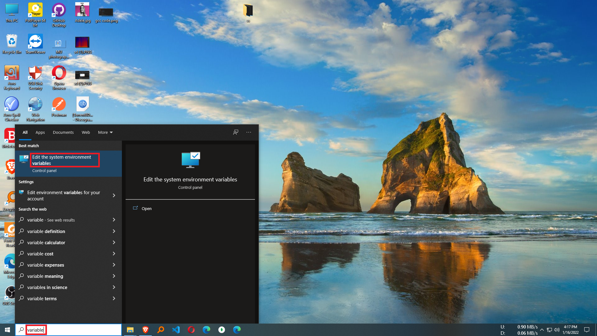
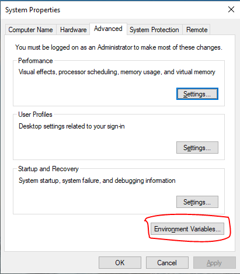
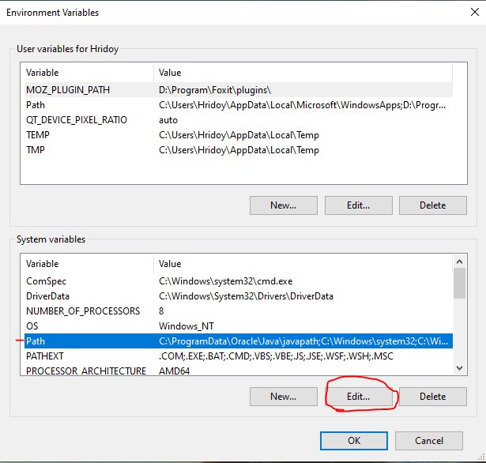
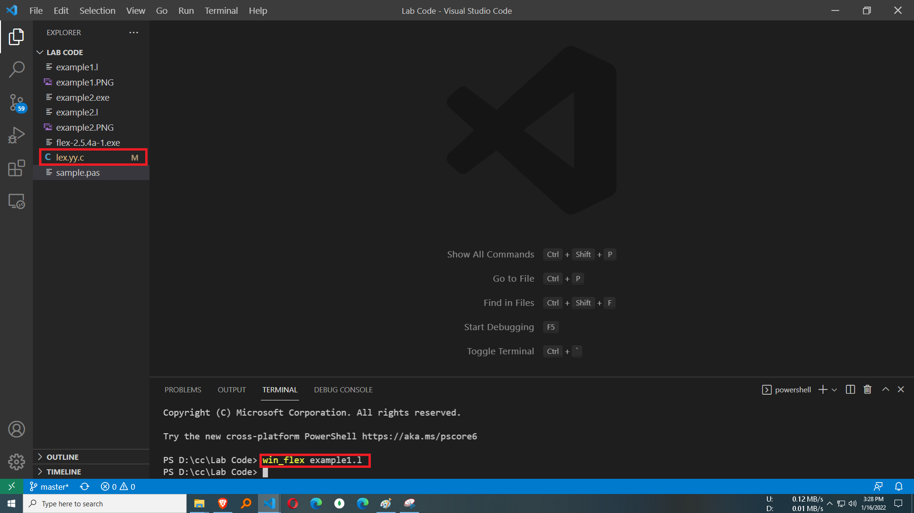
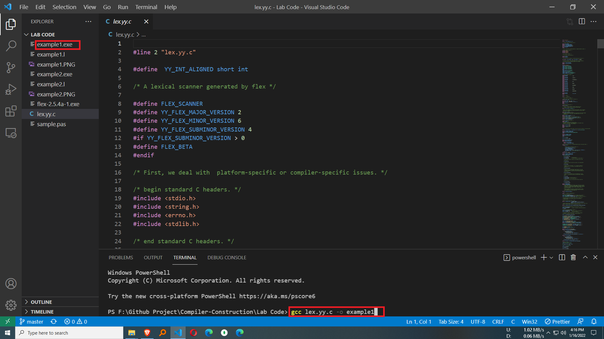
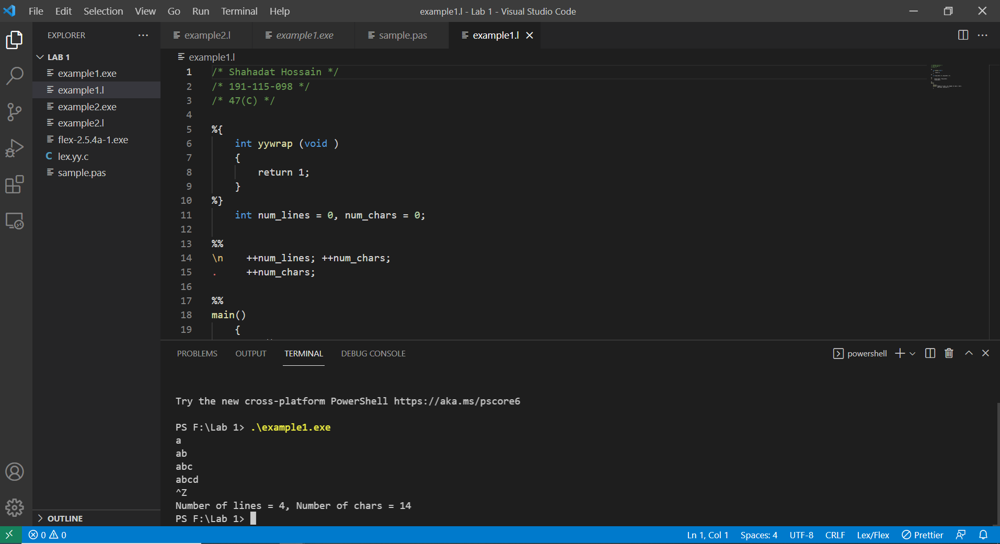
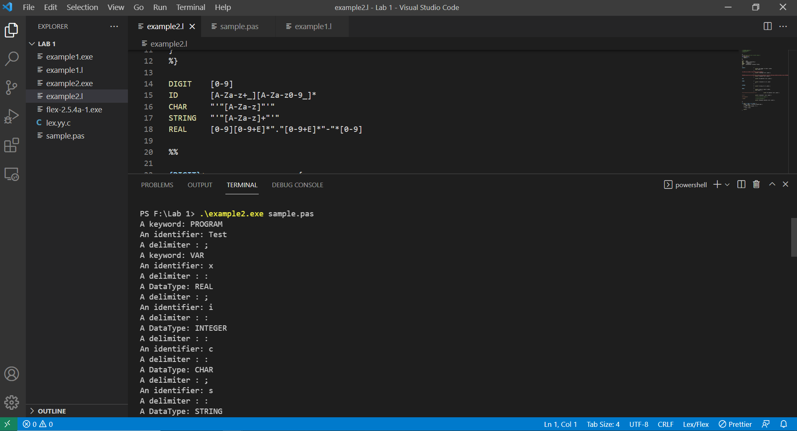

# Compiler-Construction
<h3 align="center" > Compiler Construction </h1>

### Course Summary
Compiler Construction Is One Of The Major Course of CSE. You'll Get This Course In 3nd Year.In This Course You'll Learn the theory and practice of developing programming languages and their associated compilers.The theoretical portion is primarily concerned with syntax, grammar and semantics of programming languages. One could say that this gives this particular area of computer science a strong tie with linguistics.

### Lab Code
you'll get some lab code in this repo, before checking these code i strongly suggests you to try yourself first and then check these code if you can't solve...

### Installing Necessary Software
*Bison 3
*Mingw Compiler
*Vscode

### Setup Environmnet Variable 
First You Need to Set the path for bison and mingw compiler

  <b>start and write variable</b> 
     
   <b> Environment Variable</b> 
     
    <b> Edit Path</b> 
     
    <b> New Path for Bison and Mingw</b> 
     

### How To Run Code
**Open Code Folder Using Vscode then get Terminal then write those command:**

  <b>` win_flex ` command then file name with extension then it will create lex.yy.c file</b> 
     
   <b>then ` gcc lex.yy.c -o ` file name you want to save </b> 
     
    <b>then it will create a exe file. run exe file like this</b> 
     
    <b> Second Code Output</b> 
     

